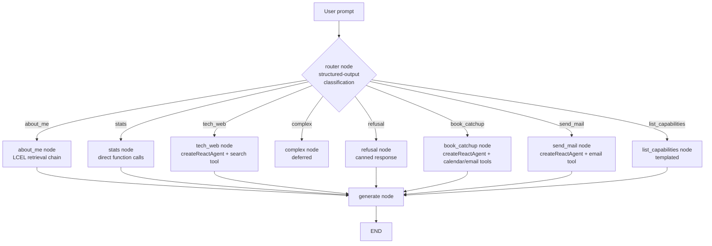

# MoonMind Agentic Workflow — Master Plan & LLD

Companion to `moonmind-langchain-feasibility.md`. This version corrects two things from the previous draft: the deployment model (was wrongly assumed to be Vercel serverless — it's actually a self-hosted, always-on Docker container) and the framework stance (a detour tried to build this "with LangChain but not LangGraph," which doesn't hold up — LangGraph is the orchestration layer *of* LangChain, not a separate framework to adopt later. This version uses both together, as one stack, throughout).

## 0. Corrected foundations

- **Deployment is a self-hosted, always-on container, not serverless.** Confirmed from the actual `Dockerfile`/`docker-compose.yml`/`.github/workflows/deploy.yml`: a long-running `node api/index.js` process in Docker on an Oracle Cloud VM, behind Nginx, `restart: unless-stopped`. (The repo also has a `vercel.json` — that's a stale leftover from an earlier deployment target and isn't what's actually running; disregard it.) This removes every serverless-timeout concern from the previous draft — no `maxDuration` budget, no need for `waitUntil()` tricks to keep work running past a response, no pressure to keep chains short to fit a function timeout. A long agentic run can just run.
- **The `/chat` endpoint is gated by a single shared password header**, not per-visitor identity — unchanged from before, still shapes the Action-branch design (visitor identity has to come from the conversation, not from auth).

## 1. Framework stance (corrected)

LangChain and LangGraph are not two frameworks to choose between, or two phases to learn in sequence — LangGraph is the part of the LangChain ecosystem built for exactly what a router-plus-branches-plus-tool-calling-agent needs: a stateful graph with nodes, conditional edges, and persistence across turns. `@langchain/core` (models, prompts, tools, structured output) is the vocabulary; LangGraph is the sentence structure for anything with branching or state. This design uses both, together, from the first line of code:

- The whole workflow is **one `StateGraph`**, authored directly (nodes + conditional edges) — not hidden behind another abstraction.
- **Deterministic nodes** (`about_me`, `stats`, `refusal`, `list_capabilities`) are graph nodes whose implementation is a plain async function or an LCEL chain (`RunnableSequence`, `.withStructuredOutput()`) — using LangChain's model/prompt/structured-output primitives, called from inside a normal graph node. Nothing exotic.
- **Agentic nodes** (`tech_web`, `book_catchup`, `send_mail`, later `complex`) are built with LangGraph's prebuilt `createReactAgent` (`@langchain/langgraph/prebuilt`) — a ready-made "call tools until done" subgraph, bound with only the tools relevant to that branch. This is the simple option: it's a couple of lines, not a hand-rolled loop, and it's real LangGraph, used the way it's meant to be used.
- Session continuity (multi-turn slot-filling for booking, conversation memory generally) comes from LangGraph's own checkpointing, keyed by `thread_id = sessionId` — a Mongo-backed checkpointer, since Atlas is already the datastore.
- The live-step-feed requirement (from the earlier discussion) comes from the compiled graph's own `.stream()` / `.streamEvents()` — every node entry/exit is an event, for free, with no separate instrumentation layer.

That's the "best yet simple" answer: one real StateGraph, LangChain primitives inside its nodes, LangGraph's own prebuilt agent helper for the tool-calling branches. Nothing here is trying to avoid LangGraph or delay it to a later phase.

## 2. Intent taxonomy (unchanged)

```
Question
├── about_me         → retrieval pipeline (existing, LangChain-rebuilt)
├── stats             → GitHub / LeetCode tools (deterministic dispatch)
├── tech_web          → web search agent (createReactAgent, 1 tool)
├── complex           → multi-tool agent (time + metadata + semantic [+ web]) — deferred
└── refusal           → polite decline, no tool call

Action
├── book_catchup      → calendar + email agent (visitor books time with Ayan)
├── send_mail         → email agent (general message to Ayan)
└── list_capabilities → templated response, no tool call
```

## 3. Architecture



One `StateGraph`, one router node with a conditional edge per route, one node per branch, all converging on a `generate` node before `END`. State schema:

```
{
  sessionId (= thread_id), rawQuery, messages,
  route, routeConfidence, slots,
  documents, statsPayload, searchResults,
  pendingConfirmation,
  summary
}
```

## 4. Feasibility per route

Unchanged from the earlier review — the codebase-grounded findings still hold, only the implementation vocabulary is corrected:

- **`about_me`** — reuse `pipeline.js`/`intentExtractor.js`/`retrievalEngine.js`/`ranker.js`/`llmReranker.js`/`responseGenerator.js` logic, rebuilt as LCEL inside one graph node. No new capability.
- **`stats`** — reuse `statsService.js` as-is; the router's classification replaces `statsRouter.js`'s regex. Plain function dispatch inside the node, no agent needed here — the router already decided.
- **`tech_web`** — net-new. One `createReactAgent` bound with a single web-search tool (Tavily recommended). Guardrail: this agent is never given calendar/email tools — enforced by what's passed to `createReactAgent`, not by prompting.
- **`complex`** (deferred) — one `createReactAgent` with four tools bound once they exist: a time/date-resolution tool, the existing metadata-filter query, the existing semantic search, and the web-search tool from `tech_web`. Build last, after the others exist as reusable tools.
- **`refusal` / `list_capabilities`** — trivial, no LLM call needed beyond the router's own classification (refusal), or a templated list generated from the route enum (capabilities).
- **`book_catchup`** — net-new, highest risk (nothing calendar/email-related exists in the repo today). One-time OAuth grant from Ayan for his own Google Calendar (env-var refresh token, same pattern as `GITHUB_PAT`); slot-filling via the agent's checkpointed thread state; a free/busy check before proposing a time; explicit confirm-before-write turn; `express-rate-limit` (already a dependency) applied tightly to this route, since the endpoint has no real visitor identity to lean on.
- **`send_mail`** — shares the email tool with `book_catchup`'s confirmation email. Recommend an HTTP-API provider (Resend/SendGrid) over SMTP, matching the codebase's existing raw-`fetch`-to-REST-API style. Only ever sends *to* Ayan — never visitor-controlled destination — so it can't become an open relay.

Open decisions still needed before Phase 6 (unchanged): calendar provider confirmation, email provider choice, bookable hours/timezone, and whether confirmation requires an emailed link or just a chat "yes."

## 5. Data model — Mongo document shape & embeddings

Grounded in `models/vectorDocument.js` (the collection's Mongo JSON Schema validator — enforced at the DB level, not just convention) and a live document from `moonmind_documents_v3`.

### Document shape

```json
{
  "_id": "ObjectId(...)",
  "id": "3341e59a-2a2f-4e8a-8aff-eb957e1ceeba",
  "title": "Ayan Maiti - Professional Resume Overview",
  "category": "experience",
  "tags": ["java", "springboot", "dotnet", "azure", "microservices", "generative-ai", "..."],
  "summary_for_embedding": "java, springboot, dotnet, azure, microservices, ... (keyword-dense, not prose)",
  "content_full": "Ayan Maiti is a Systems Engineer at Tata Consultancy Services working on Azure-based integration systems... (full prose)",
  "metadata": {
    "domain": "experience",
    "subcategory": ["cloud", "ai", "backend", "generative-ai", "experimental"],
    "verified": true,
    "proficiency_level": null,
    "organization": "self",
    "impact_score": 100,
    "is_active": true,
    "date_start": "2022-01-01T00:00:00.000Z",
    "completion_year": 2026,
    "external_links": { "portfolio": "...", "resume": "...", "github": "...", "leetcode": "...", "linkedin": "..." }
  },
  "created_at": "2026-03-29T15:10:58.966Z",
  "updated_at": "2026-07-10T12:47:16.224Z",
  "embedding": [/* 768 floats */]
}
```

Schema-enforced constraints worth carrying into the rebuild as-is (the validator rejects anything that violates these, so the new codebase's ingestion path — and any future agentic "add/update document" tool — has to satisfy the same rules):

- `category` ∈ `ALLOWED_CATEGORIES` (singular: `skill`, `certification`, `credential`, `education`, `experience`, `profile`, `project`, `hobby`, `topic`) — while `metadata.domain` ∈ `ALLOWED_DOMAINS` (plural: `skills`, `projects`, `experience`, `profile`, `certifications`, `education`, `achievements`, `research`, `hobbies`). These are two separate enums by design (`CATEGORY_DOMAIN_MAP` in `config/vectorConfig.js` maps one to the other) — already flagged in project memory as a recurring source of payload errors, worth a validation helper in the new codebase rather than relying on callers to get it right.
- `metadata.subcategory` is a array drawn from a large controlled vocabulary (`ALLOWED_SUBCATEGORIES`, ~90 values spanning technical skills, soft skills, and meta-tags like `experimental`/`production-grade`).
- `embedding` must be exactly 768 numbers (`EMBEDDING_DIMENSIONS`, matched to the Atlas index's `numDimensions`) — a mismatch doesn't error at write time from the schema's perspective (it just checks `bsonType`, not array length), but makes the document unsearchable by `$vectorSearch` silently.
- `content_full` and most `metadata` date/organization/link fields are nullable — `about_me` retrieval and the response generator both already handle sparse documents gracefully; worth preserving that tolerance in the rebuild rather than assuming every field is populated.

### Embedding generation

- **Model:** `gemini-embedding-2` (Google), 768 dimensions, via `src/moonmind/adapters/geminiClient.js` — a raw `fetch` to `{GEMINI_BASE_URL}/v1beta/models/{model}:embedContent`, one text per call. Batching multiple inputs in one call is deliberately avoided in the current code (a comment notes Gemini would return one aggregated vector for a batch, not one per input — silently wrong rather than erroring), and that constraint carries over to any LangChain embeddings wrapper too.
- **Two prompt templates, and they must never drift apart** (`utils/embeddingGenerator.js`): documents are embedded as `title: <title> | text: <Tags: ...>\n<summary_for_embedding>\n<content_full>`, truncated to a ~28,000-character budget (word-boundary aware, trims `content_full`'s tail first since tags/summary are prepended); queries are embedded as `task: search result | query: <query>`. `gemini-embedding-2` carries retrieval-task intent through this prompt text rather than a `taskType` API parameter (the model's predecessor, `gemini-embedding-001`, used `taskType` and needed manual L2-normalization of truncated Matryoshka output — `gemini-embedding-2` auto-normalizes and needs neither). This is exactly the detail that makes a stock `@langchain/google-genai` embeddings class risky to swap in wholesale for Phase 3 — the feasibility doc's recommendation to wrap the existing `embedText` in a small custom LangChain `Embeddings` subclass (rather than replace it) is what preserves these templates byte-for-byte against the vectors already sitting in Atlas.
- **Storage:** `moonmind_documents_v3` collection (`MONGO_VECTOR_COLLECTION`), `embedding` field (`MONGO_VECTOR_FIELD`), Atlas vector index `vector_index` (`MONGO_VECTOR_INDEX`) — all three names are env-driven, not hardcoded, consistent with the rest of the config.

### LLM (chat) implementation

- **Provider:** OpenAI, via a hand-rolled REST adapter (`src/moonmind/adapters/openaiClient.js`) — raw `fetch` to `{OPENAI_BASE_URL}/v1/chat/completions`, not the official SDK. This is the piece a LangChain `ChatOpenAI` instance directly replaces (same API surface underneath).
- **Model:** `gpt-4o-mini` by default at all four call sites, each independently env-overridable: `MOONMIND_INTENT_MODEL`, `MOONMIND_RESPONSE_MODEL`, `MOONMIND_RERANK_MODEL` (falls back to `RESPONSE_MODEL`), `MOONMIND_DECOMPOSE_MODEL` (falls back to `INTENT_MODEL`) — worth keeping that independence (four env vars, not one shared model constant) in the rebuild, since it's already there for a reason (letting the reranker or decomposer run on a cheaper/different model later without touching the others).
- **Structured output today:** every call requests `response_format: { type: "json_object" }` with `temperature: 0` and a hand-written system prompt describing the exact JSON shape — this is precisely what `.withStructuredOutput(zodSchema)` formalizes in the rebuild, using the `zod` schemas the project already depends on.
- **Four call sites, unchanged in the rebuild's `about_me` node:** `intentExtractor.js` (intent + taxonomy classification, 1–2 calls), `planning/queryDecomposer.js` (sub-query split, optional via `DECOMPOSE_ENABLED`), `ranking/llmReranker.js` (candidate reordering, optional via `RERANK_ENABLED`), `responseGenerator.js` (final answer).

## 6. Master plan

Step-by-step, each with a concrete "done when." Points 1 and 2 from the broader ask (new clean codebase, replacing the MoonMind pipeline) are Phases 0–3 below; the live event feed is Phase 4; everything net-new (web search, actions, complex) follows.

| Phase | Scope | Done when |
|---|---|---|
| **0 — New repo, capability parity** | Fresh Node/Express repo (same JS/CommonJS stack as today — no new build tooling while you're also learning LangChain). Port: Express skeleton, Mongo connection, GitHub/LeetCode stats endpoints+services, Docker + docker-compose + GitHub Actions CI/CD, env conventions, `/health`. | New repo deployed (own subdomain or port on the same VM), `/leetcode`, `/github`, `/refresh` return output matching the old repo's, via CI/CD. |
| **1 — Graph skeleton: router + trivial branches** | Install `langchain`, `@langchain/core`, `@langchain/langgraph`, a model provider package, `zod` (already used). Build the `StateGraph`: router node (structured-output classification into all 8 routes) + `refusal` + `list_capabilities` fully working; other routes stub to "not implemented yet." New `/api/v1/moonmind/chat` endpoint invoking the graph. | All 8 route types classify correctly (verified via Postman); `refusal` and `list_capabilities` return real answers. |
| **2 — `stats` node** | Port `getGithubStats`/`getLeetcodeStats` as the node's implementation, keyed off the router's `which` slot. | Stats questions return live data matching the old pipeline's output. |
| **3 — `about_me` node** | Rebuild decompose → intent → retrieve → rank → rerank → generate as LCEL inside one node. Keep RRF/ranker logic as-is (deterministic, not LLM-dependent); optionally swap the hand-rolled `$vectorSearch` for `@langchain/mongodb`'s vector store. | A fixed set of ~10 test About-Me questions return answers equivalent in quality to the old MoonMind pipeline. |
| **4 — Live event feed** | `runs`/`steps` Mongo collection; `POST /runs` (kicks off the graph), `GET /runs/:id?since=` (polling). Feed the step log from the graph's `.stream()`. Being a long-running process now (not serverless), this can run synchronously in the request handler without any timeout workaround — and a true SSE endpoint is now also a realistic option instead of polling, worth a quick call before building this phase. | A test page posts a prompt and watches steps arrive in order, ending in the final answer. |
| **5 — `tech_web` node** | Pick a search provider (Tavily recommended), build the tool, wrap in `createReactAgent` with just that tool bound. | Tech/AI questions return web-grounded answers; verify the agent has no path to calendar/email tools. |
| **6 — `book_catchup` + `send_mail`** | Resolve the four open decisions with Ayan first. Then: Google Calendar OAuth + freebusy + create-event tools, email tool, `createReactAgent` with checkpointed state for slot-filling, confirm-before-write step, tight rate limiting. | A full booking conversation (ask → fill slots → confirm → event created → confirmation email sent) works end to end against a real test calendar. |
| **7 — `complex` node** | Compose a new time-resolution tool with the existing metadata-filter and semantic-search tools (+ web search) into one `createReactAgent`, four tools bound. | The three example queries from the original taxonomy ("backend skills 2023 vs now," "how has Ayan upskilled in AI," "AI projects + market relevance today") produce coherent, correctly-sourced answers. |
| **8 — Cutover** | Point the live portfolio frontend at the new codebase. Monitor. Decommission the old MoonMind pipeline. | Old pipeline receives zero production traffic for an agreed period; archived. |

Suggest starting Phase 0 next, since everything after it depends on having somewhere to put the code.
